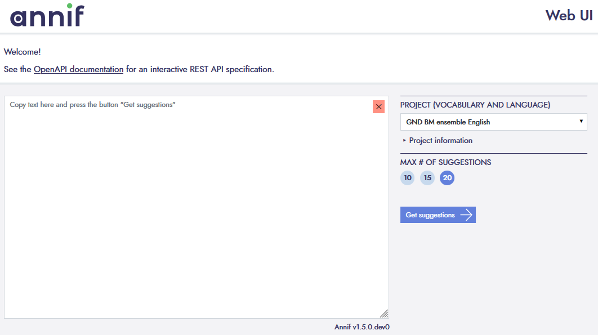
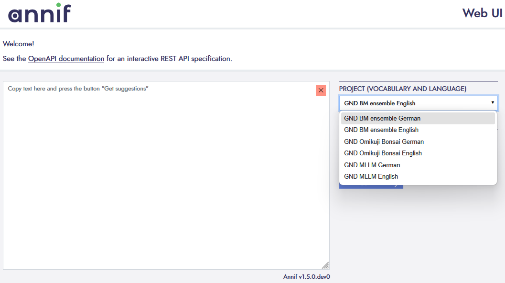
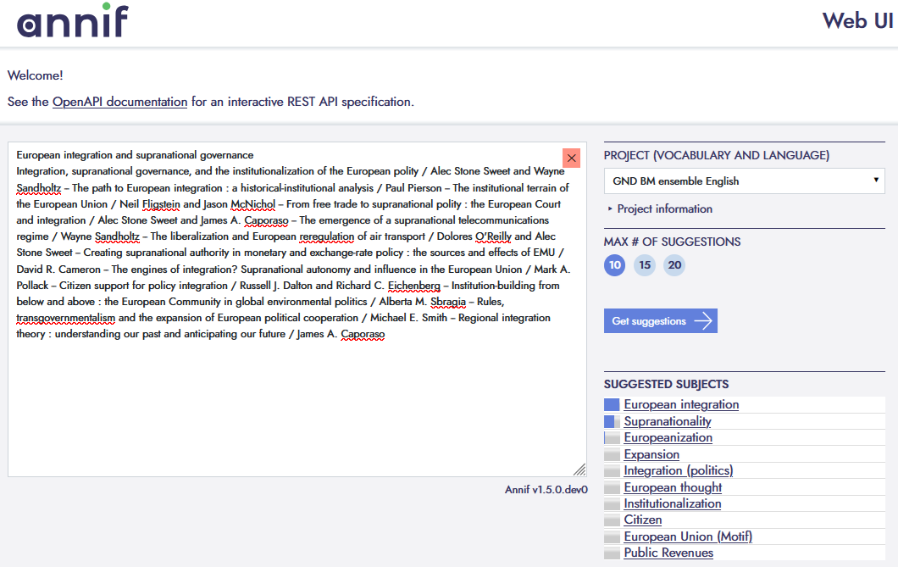
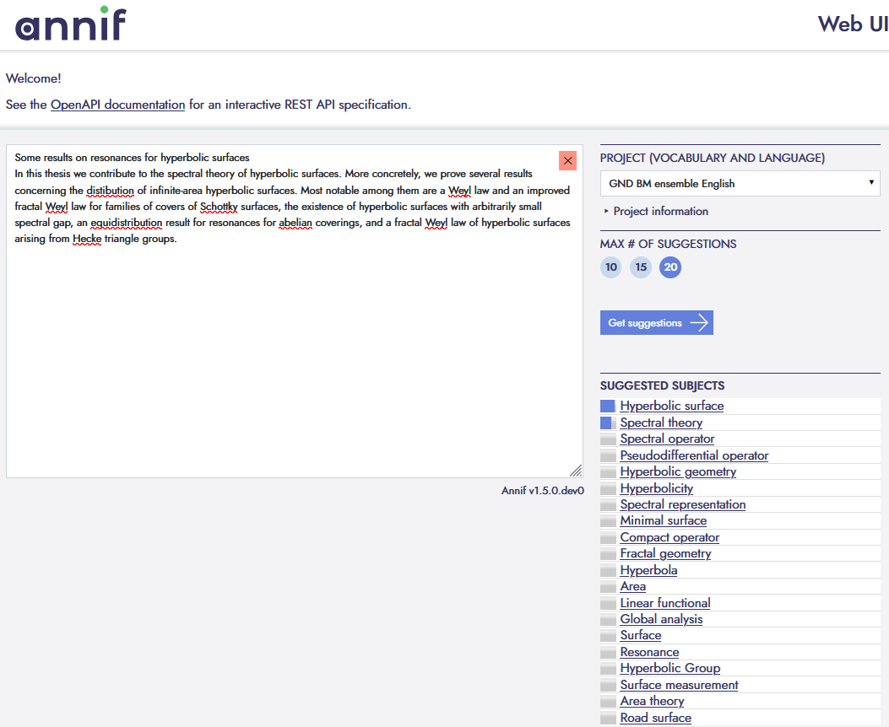

# Annif BM-Ensemble Demo Application (Docker-based)

This repository provides a **minimal, reproducible setup** to run **Annif** with selected **GermEval 2025 LLMs4Subjects models** (BM ensemble, Bonsai, MLLM) via **Docker**, and to use Annif through its **built-in Web UI and REST API**.

If the GND is your classification taxonomy, consider this as a librarian personal assistant

---

## Overview

You will:

1. Install Docker  
2. Start an Annif Docker container  
3. Download pre-trained GermEval 2025 models from Hugging Face  
4. Launch Annif’s Web UI on `localhost`  
5. Test subject recommendations interactively  

---

## 1. Install Docker

Install **Docker Desktop** from:

https://docs.docker.com/get-docker/

Ensure Docker is running and has **≥ 8 GB RAM** available.

---

## 2. Prepare a local working directory

Create an empty directory, e.g.:

```
C:\path\to\annif-projects
```

This directory will persist all Annif data.

---

## 3. Start the Annif Docker container

```bat
cd /d C:\path\to\annif-projects

docker run -it --rm ^
  -p 5000:5000 ^
  -v "%cd%":/annif-projects ^
  quay.io/natlibfi/annif bash
```

> **First run:** Docker will automatically download the Annif image. This may take a few minutes.
> **Note:** If you have already started Annif before and `http://localhost:5000` opens in your browser, you do **not** need to run this command again.
> If you see a message that port `5000` is already in use, see *Troubleshooting when restarting your laptop* at the end of this README.

---

## 4. Download GermEval 2025 models

> **This step only needs to be done once.**  
> After the models are downloaded, they are stored in your local working directory and will be reused in future sessions.

Inside the container:

```bash
cd /annif-projects

annif download --trust-repo "gnd-bm-ensemble-*" NatLibFi/Annif-LLMs4Subjects-GermEval2025-data
annif download --trust-repo "gnd-bonsai-*" NatLibFi/Annif-LLMs4Subjects-GermEval2025-data
annif download --trust-repo "gnd-mllm-*" NatLibFi/Annif-LLMs4Subjects-GermEval2025-data
```

Available models:
https://huggingface.co/NatLibFi/Annif-LLMs4Subjects-GermEval2025-data

---

## 5. Verify installation (one-time check)

> This check is only required the first time to confirm that the models were downloaded successfully.

```bash
annif list-projects
```

---

## 6. Launch the Web UI

```bash
annif run --host 0.0.0.0 --port 5000
```

Open:
http://localhost:5000

---

## 7. Screenshots and example walkthroughs

All screenshots referenced in this section are stored in the `assets/` folder of this repository.

### Web UI overview

After successfully starting Annif, the Web UI should appear as follows:



Once the GermEval 2025 models have been downloaded, they are available to the end user via a dropdown list:



> **Performance note**  
> When a model is selected for the first time after startup, it may take some time to load into memory.  
> Once loaded, subsequent predictions are significantly faster.

---

### Example 1: Conference paper (German)

Source record:  
https://github.com/sciknoworg/llms4subjects/blob/main/shared-task-datasets/TIBKAT/all-subjects/data/test/gold-standard-testset/Conference/de/3A024846546.jsonld

Steps:
- Copy the **title and abstract** into the input field
- Select **`gnd-bm-ensemble-de`**
- Set **max. suggestions = 20**
> Max # Suggestions determine how many subjects are recommended.
- Click **Get suggestions**


---

### Example 2: Report (English)

Source record:  
https://github.com/sciknoworg/llms4subjects/blob/main/shared-task-datasets/TIBKAT/all-subjects/data/test/gold-standard-testset/Report/en/3A244453667.jsonld

Steps:
- Select **`gnd-bm-ensemble-en`**
- Set **max. suggestions = 10**



---

### Example 3: Thesis (English)

Source record:  
https://github.com/sciknoworg/llms4subjects/blob/main/shared-task-datasets/TIBKAT/all-subjects/data/train/Thesis/en/3A1667217267.jsonld



---

### Example 4: Article (German)

Source record:  
https://github.com/sciknoworg/llms4subjects/blob/main/shared-task-datasets/TIBKAT/all-subjects/data/train/Article/de/3A1762285525.jsonld


---

## Troubleshooting when restarting your laptop

If you have already started Annif once, you usually **do not need to run the `docker run …` command again** (step 3 above) after restarting your laptop.

### Just open the Web UI
If Annif was running before shutdown and Docker has restarted it automatically, simply open:

http://localhost:5000

in your browser.

---

### If `localhost:5000` does not open

Check whether the Annif container is running:

```bat
docker ps
```

- If an Annif container is listed and mapped to port `5000`, the Web UI should be available.
- If no container is running, start Annif again by following **Step 3** and **Step 6** of this README.

---

### If port 5000 is already in use

If you see an error such as:

Bind for 0.0.0.0:5000 failed: port is already allocated

another container (often a previous Annif instance) is already using the port.

Stop it with:

```bat
docker stop <container-name-or-id>
```

Then either:
- reopen http://localhost:5000, or  
- restart Annif following the steps above.

---

### Important note
- Turning your laptop **off** stops all containers.
- When Docker starts again, containers that were previously running **may automatically restart**.
- In that case, Annif is already available and **no new setup is required**.

---

## 8. References

- Annif: https://github.com/NatLibFi/Annif  
- Models: https://huggingface.co/NatLibFi/Annif-LLMs4Subjects-GermEval2025-data  

---

## 9. Citations

### Annif at GermEval 2025

To learn more about these models please read the following paper.

```bibtex
@inproceedings{suominen2025annif,
  title={Annif at the GermEval-2025 LLMs4Subjects Task: Traditional XMTC Augmented by Efficient LLMs},
  author={Suominen, Osma and Inkinen, Juho and Lehtinen, Mona},
  booktitle={Proceedings of the 21st Conference on Natural Language Processing (KONVENS 2025): Workshops},
  pages={447--454},
  year={2025}
}
```

To learn more the LLMs4Subjects initiative in the context of which these and other models were developed, please read the following papers.

### SemEval-2025 Task 5: LLMs4Subjects

```bibtex
@inproceedings{dsouza-etal-2025-semeval,
  title = {{S}em{E}val-2025 Task 5: {LLM}s4{S}ubjects - {LLM}-based Automated Subject Tagging for a National Technical Library's Open-Access Catalog},
  author = {D'Souza, Jennifer and Sadruddin, Sameer and Israel, Holger and Begoin, Mathias and Slawig, Diana},
  booktitle = {Proceedings of the 19th International Workshop on Semantic Evaluation (SemEval-2025)},
  year = {2025},
  publisher = {Association for Computational Linguistics},
  url = {https://aclanthology.org/2025.semeval-1.328/}
}
```

### GermEval 2025 Shared Task Dataset

```bibtex
@misc{D_Souza_The_GermEval_2025_2025,
  author = {D'Souza, Jennifer and Sadruddin, Sameer and Israel, Holger and Begoin, Mathias and Slawig, Diana},
  title = {{The GermEval 2025 2nd LLMs4Subjects Shared Task Dataset}},
  year = {2025},
  doi = {10.5281/zenodo.16743609},
  url = {https://github.com/sciknoworg/llms4subjects}
}
```